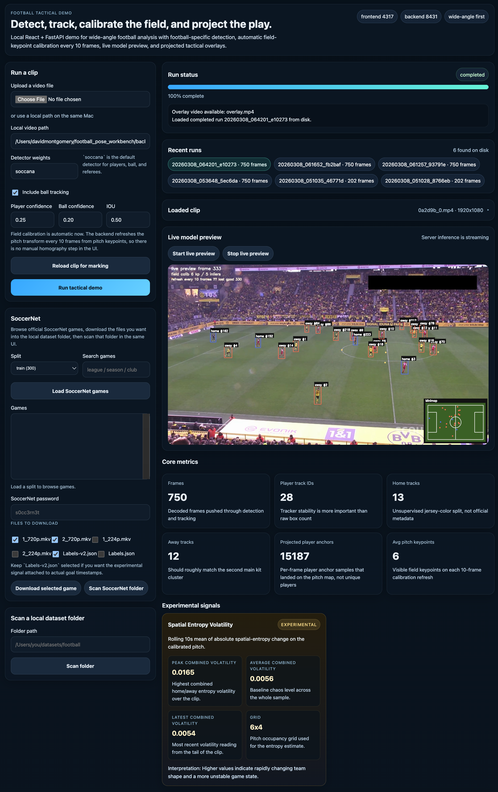
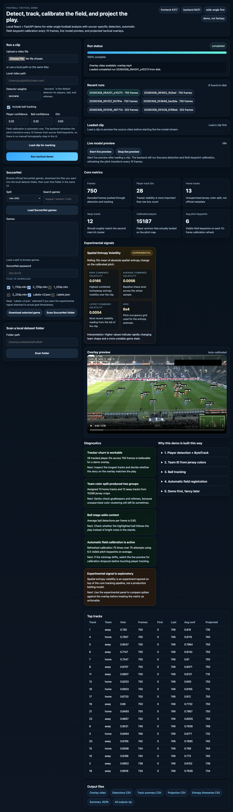
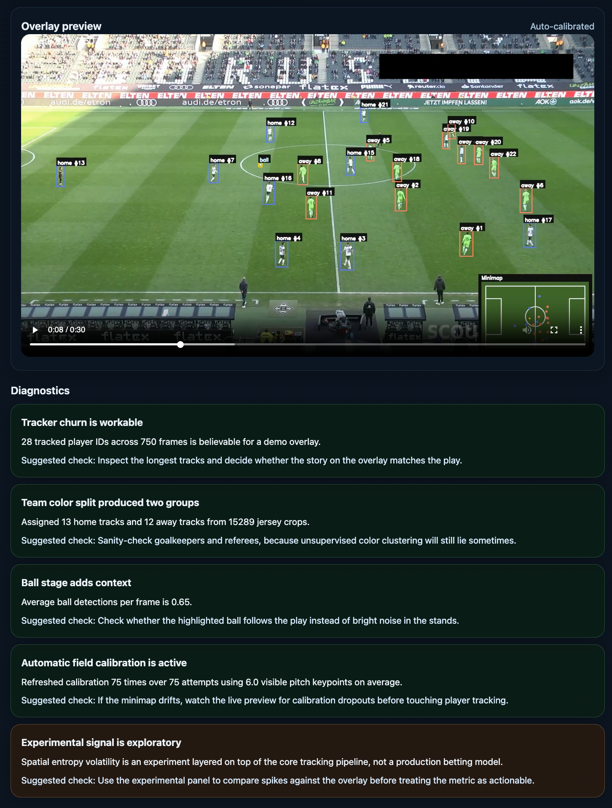

# Football Tactical Workbench

Browser-first football analysis workbench built with React and FastAPI.

The current codebase is a wide-angle football pipeline with five core stages:

- detects players, referees, and the ball with `soccana`
- tracks players with a hybrid appearance-aware ReID tracker and post-pass stitcher
- separates home and away tracks with jersey-colour clustering
- refreshes pitch calibration every 10 frames with `soccana_keypoint`
- writes a saved overlay run with CSV, JSON, and review artifacts

This README follows the current code and verified runtime behaviour.

## Screenshots







## What The App Does

- load a football clip from upload or local filesystem path
- stream a live preview from `/api/live-preview`
- run a saved analysis job through `/api/analyze`
- review completed runs from `backend/runs/<run_id>/outputs`
- generate AI-curated per-run diagnostics and run briefs when a provider is configured
- browse and download SoccerNet halves and label files from the UI
- scan a local dataset folder for videos and annotations
- export overlay video, detections, track summaries, pitch projections, experiment data, and a zipped run bundle

## Current Defaults

- player detector: `soccana`
- ball detector: shared `soccana` detector
- field calibration model: `soccana_keypoint`
- player tracker: `hybrid_reid`
- ball tracker: `bytetrack.yaml`
- calibration refresh cadence: every `10` frames
- frontend dev server: `127.0.0.1:4317`
- backend API server: `127.0.0.1:8431`
- run storage: `backend/runs/`
- model cache: `backend/models/`

## Quick Start

### 1. Install backend dependencies

```bash
cd backend
python3 -m venv .venv
source .venv/bin/activate
python -m pip install --upgrade pip
pip install -r requirements.txt
```

### 2. Install frontend dependencies

```bash
cd frontend
npm install
```

### 3. Optional environment file

```bash
cp .env.example .env
```

You only need `.env` if you want:

- SoccerNet downloads through the batch launcher
- AI diagnostics through OpenAI, OpenRouter, Anthropic, or a local OpenAI-compatible endpoint

### 4. Start the app

Backend:

```bash
cd backend
./run_backend.sh
```

Frontend:

```bash
cd frontend
./run_frontend.sh
```

Or run both together:

```bash
./run_all.sh
```

To stop a backend started through `run_all.sh`:

```bash
./stop_backend.sh
```

## First Run Workflow

1. Open `http://127.0.0.1:4317`.
2. Load a clip from upload or paste a local filesystem path.
3. Optionally open the live preview workspace to stream the detector output.
4. Click `Analyze loaded clip`.
5. Watch the active job logs until the run completes.
6. Switch to `Run Review` and inspect the overlay, run brief, diagnostics, tracks, and exported files.

## Runtime Behaviour

- Backend startup prewarms the default detector and field-calibration models from the local model cache or configured model source.
- The default player tracker now uses sparse appearance embeddings plus a tracklet stitch pass; run summaries report both raw IDs and stitched canonical IDs.
- The first `hybrid_reid` run may need to populate torchvision appearance weights in the local torch cache before tracking starts.
- Overlay export targets browser playback: the backend transcodes to H.264 when `ffmpeg` is available and also attempts direct browser-codec writing when it is not.
- Loaded sources and job snapshots are persisted, so sources survive restarts and interrupted jobs resume automatically instead of disappearing.
- Every completed run stores a run brief and diagnostics artifact. With a provider configured, the run brief and diagnostics are AI-curated for that run.
- Goal-aligned experiment inputs can come from discovered label files or from an explicit label path selected in the UI.
- The UI includes a `Reset` control for clearing saved theme and form state from browser local storage.

## Documentation

- [Getting Started](docs/getting-started.md)
- [Workflows](docs/workflows.md)
- [Outputs, API, and Batch Experiments](docs/outputs-and-api.md)

## Repository Map

- `backend/app/main.py`
  FastAPI entrypoint, source loading, SoccerNet endpoints, run loading, live preview, and analysis job creation.
- `backend/app/wide_angle.py`
  Active football analysis pipeline, hybrid ReID player tracking, live preview generator, overlay rendering, experiment export, and diagnostics integration.
- `backend/app/reid_tracker.py`
  Appearance-aware player tracking, sparse embedding extraction, field-aware association, and post-pass tracklet stitching.
- `backend/app/ai_diagnostics.py`
  Provider selection, prompt construction, OpenAI-compatible/Anthropic calls, and diagnostics artifact writing.
- `backend/scripts/soccernet_batch_experiment.py`
  Batch SoccerNet downloader plus repeated analysis runner.
- `backend/scripts/start_soccernet_batch_tmux.sh`
  Convenience launcher for long SoccerNet batch experiments in `tmux`.
- `frontend/src/App.jsx`
  Single-page application for clip loading, live preview, active jobs, run review, folder scan, and SoccerNet browsing.
- `frontend/src/styles.css`
  Complete UI styling, theme tokens, responsive layout, and review workspace presentation.

## SoccerNet

The application has first-class SoccerNet support in code:

- it lists train, valid, test, and challenge splits
- it searches official game paths
- it downloads halves and labels into `backend/datasets/soccernet/`
- it can scan that folder directly from the UI
- it prefers `Labels-v2.json` for goal-aligned experiment work

If you want to evaluate the geometric volatility experiment against actual goals, use a source clip with SoccerNet labels nearby or select an explicit label path in the UI.

## Acknowledgements

- [SoccerNet](https://www.soccer-net.org/) for match data structure, labels, and downloader tooling
- [Soccana](https://huggingface.co/Adit-jain/soccana) for football-specific detector weights
- [Soccana Keypoint](https://huggingface.co/Adit-jain/Soccana_Keypoint) for pitch keypoint weights
- [Ultralytics](https://www.ultralytics.com/) for the YOLO runtime used by the detector and keypoint models
- ByteTrack via Ultralytics tracker integration for the current ball-tracking path and the legacy player-tracking fallback
- Torchvision ResNet-18 weights for sparse appearance embeddings in the player ReID path

## License

MIT. See [LICENSE](LICENSE).
